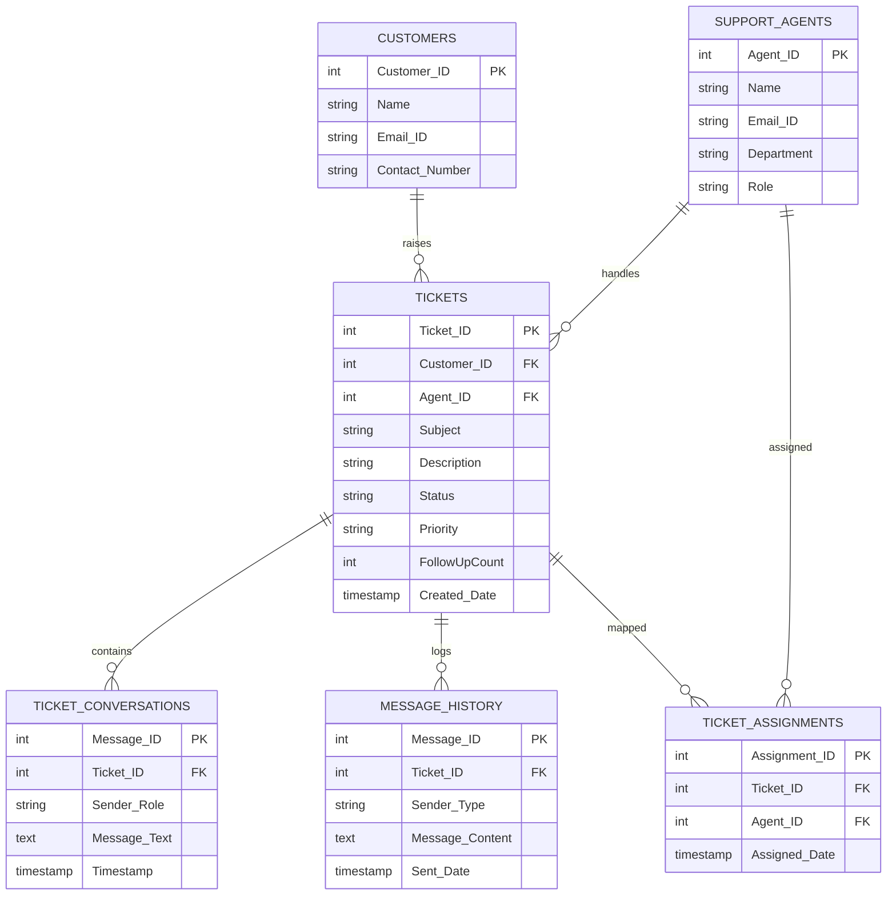

<h1 align="center">🎧 Customer Support Ticket Management System</h1>

<p align="center">
A full-stack database-driven helpdesk platform that converts customer requests into structured, trackable support tickets.
</p>

<p align="center">
  
  
  
  
  
  
  
  
</p>

## 🚀 Project Overview

Organizations relying only on email for support often face:

- ❌ Unstructured conversations  
- ❌ Missed customer queries  
- ❌ No ticket tracking  
- ❌ No accountability  
- ❌ Uneven workload distribution  
- ❌ No performance monitoring  

This system solves these issues using a centralized ticket lifecycle platform.

---

## 👥 User Roles & Capabilities

### 👤 Customer
- Raise support tickets
- Provide subject, description, priority
- View ticket history using email
- Filter tickets by status & priority
- Open ticket conversation
- Send follow-up requests
- Increase urgency of unresolved tickets
- View ticket resolution status

---

### 🧑‍💼 Support Agent
- Secure login
- View assigned tickets
- Filter tickets (status, priority, date)
- Open ticket conversations
- Reply to customers
- Resolve tickets

---

### 🛡️ Administrator
- Secure login with elevated privileges
- View all tickets
- Assign/Reassign tickets to agents
- Add staff members
- Grant roles (Agent / Administrator)
- Monitor ticket progress
- View performance analytics

---

## 🔁 Ticket Lifecycle

1️⃣ Customer raises ticket  
2️⃣ Ticket stored with **Open** status  
3️⃣ Admin assigns ticket to agent  
4️⃣ Customer ↔ Agent conversation  
5️⃣ Follow-ups increase urgency  
6️⃣ Agent resolves ticket  
7️⃣ Ticket archived for analytics  

---

## 🧠 Smart System Logic

| Feature | Behavior |
|--------|----------|
| Auto Customer Creation | New email auto-registers |
| Follow-up Boost | Increases ticket urgency |
| Role-Based Access | Controlled permissions |
| Conversation Lock | Resolved tickets read-only |
| Urgent Highlighting | FollowUpCount prioritized |
| Admin Assignment | Only admins assign tickets |

---

## 🗄️ Database Schema (Actual Implementation)

### 1️⃣ Customers
```sql
Customer_ID    INT PK AI
Name           VARCHAR(100) NOT NULL
Email_ID       VARCHAR(100) UNIQUE NOT NULL
Contact_Number VARCHAR(15)
````

---

### 2️⃣ Support_Agents

```sql
Agent_ID   INT PK AI
Name       VARCHAR(100) NOT NULL
Email_ID   VARCHAR(100) UNIQUE NOT NULL
Department VARCHAR(50)
Role       VARCHAR(50)
```

---

### 3️⃣ Tickets

```sql
Ticket_ID     INT PK AI
Customer_ID   INT FK → Customers.Customer_ID
Subject       VARCHAR(255)
Description   TEXT
Status        VARCHAR(20) DEFAULT 'Open'
Priority      VARCHAR(20)
Created_Date  TIMESTAMP DEFAULT CURRENT_TIMESTAMP
Agent_ID      INT FK → Support_Agents.Agent_ID
FollowUpCount INT DEFAULT 0
```

---

### 4️⃣ Ticket_Conversations

```sql
Message_ID   INT PK AI
Ticket_ID    INT FK → Tickets.Ticket_ID
Sender_Role  ENUM('Customer','Agent','Administrator')
Message_Text TEXT NOT NULL
Timestamp    TIMESTAMP DEFAULT CURRENT_TIMESTAMP
```

---

### 5️⃣ Message_History

```sql
Message_ID      INT PK AI
Ticket_ID       INT FK → Tickets.Ticket_ID
Sender_Type     VARCHAR(20)
Message_Content TEXT
Sent_Date       TIMESTAMP DEFAULT CURRENT_TIMESTAMP
```

---

### 6️⃣ Ticket_Assignments

```sql
Assignment_ID INT PK AI
Ticket_ID     INT FK → Tickets.Ticket_ID
Agent_ID      INT FK → Support_Agents.Agent_ID
Assigned_Date TIMESTAMP
```

---

## 🔗 Relationship Summary

| Relationship                       | Type |
| ---------------------------------- | ---- |
| One Customer → Many Tickets        | 1:N  |
| One Agent → Many Tickets           | 1:N  |
| One Ticket → Many Conversations    | 1:N  |
| One Ticket → Many History Messages | 1:N  |
| Tickets ↔ Agents via Assignments   | M:N  |

---

## 🧩 ER Diagram (Visual)



---

## 🧾 ER Diagram (Text Version)

```
Customers (1) ────────< Tickets >──────── (1) Support_Agents
                         │
                         │
                         ├──────< Ticket_Conversations
                         │
                         ├──────< Message_History
                         │
                         └──────< Ticket_Assignments >────── Support_Agents
```

---

## 🏗️ System Architecture

```
Client Browser
     ↓
Flask Web Server (MVC)
     ↓
MySQL Database
```

---

## ⚙️ Tech Stack

| Layer     | Technology        |
| --------- | ----------------- |
| Backend   | Flask (Python)    |
| Frontend  | HTML5 + Bootstrap |
| Database  | MySQL             |
| Templates | Jinja2            |


